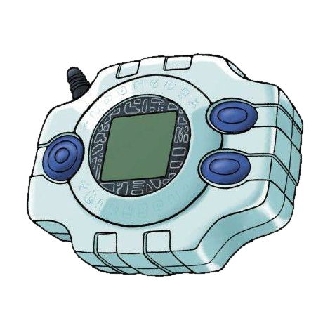
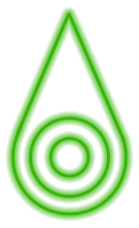
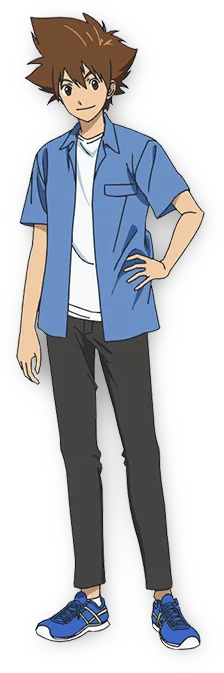
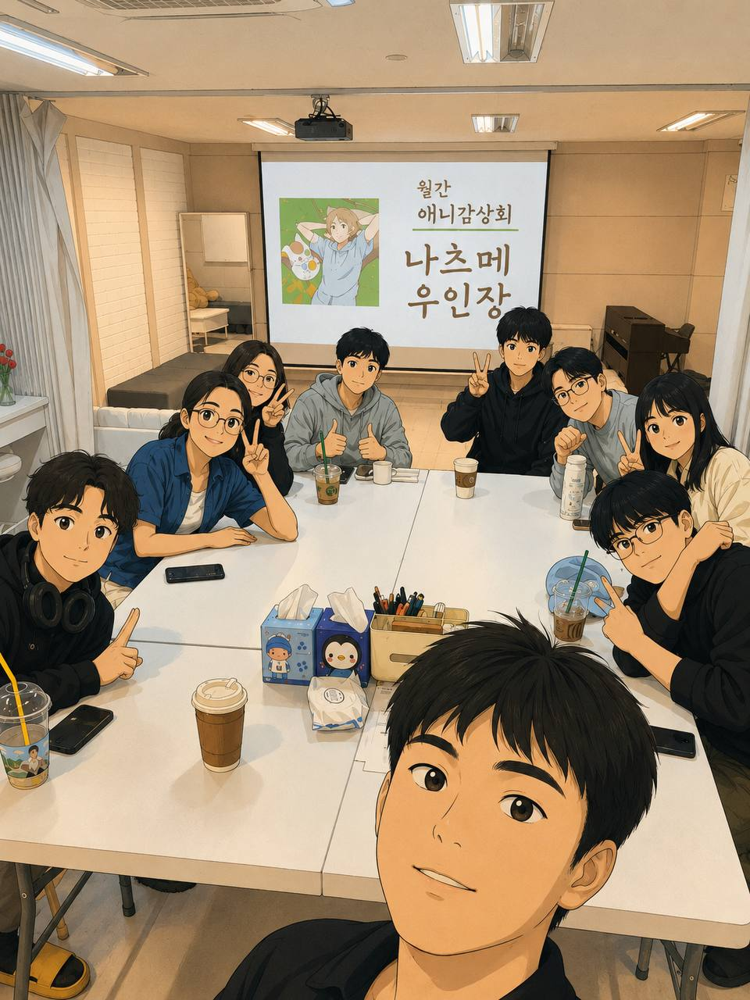
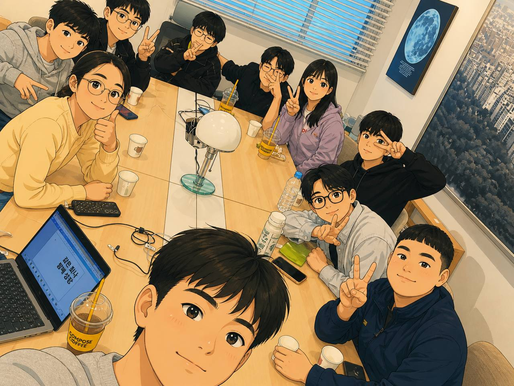
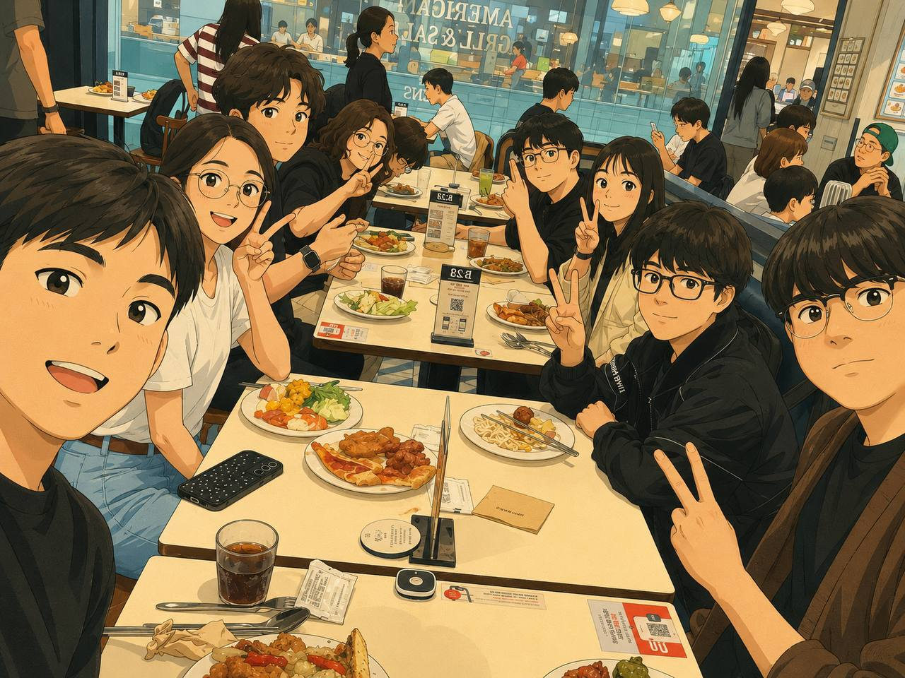

# 디지몬, 나의 선택받은 문장은?!

디지몬 어드벤처의 8개 문장 콘셉트로 만든 한국어 심리검사 웹앱입니다. 4개의 간편 질문에 답하면 용기, 우정, 순수, 사랑, 지식, 성실, 희망, 빛 중 나와 가장 가까운 문장을 결과로 보여줍니다.

<p align="center">
  
</p>

## 바로가기

- Production: https://crest-psych-test.vercel.app
- GitHub: https://github.com/mypace0600/crest-psych-test

## 서비스 미리보기

검사 시작 화면에서는 디지바이스와 8개의 문장이 떠 있는 인터랙션을 보여주고, 결과 화면에서는 선택된 문장과 캐릭터 이미지, 문장별 반응을 함께 제공합니다.

<p align="center">
  
</p>

<p align="center">
  
  
  
  
  
  
  
  
</p>

## 결과 예시

각 문장 결과는 문장 이미지, 선택받은 아이 캐릭터, 핵심 설명, 생각 변화, 키워드로 구성됩니다.

<p align="center">
  
  
  
</p>

## 애니원 모임 소개

앱 안에는 애니 동아리 `애니원` 소개 팝업이 포함되어 있습니다. 팝업에서는 활동 사진이 자동 슬라이드로 표시되고, 오픈채팅방 링크로 연결됩니다.

<p align="center">
  
  
  
</p>

## 주요 기능

- 4문항 한국어 간편 문장 심리검사
- 용기, 우정, 순수, 사랑, 지식, 성실, 희망, 빛 8개 결과 제공
- 마지막 질문 가중치와 최근 답변 기반 동점 처리
- 결과 공유 링크 생성
- 사용자별 UUID 기반 공유 URL 지원
- Supabase 연결 시 공유 결과 저장
- Supabase 미설정 시 URL 파라미터와 localStorage 기반 fallback 공유
- 결과 이미지 PNG 저장
- 저장 이미지에 문장별 반응 포함
- 문장별 선택받은 아이 캐릭터 이미지 표시
- 애니원 동아리 소개 팝업 및 활동 사진 자동 슬라이드
- SEO, Open Graph, Twitter Card, JSON-LD 메타데이터 설정

## 기술 스택

- Next.js 14
- React 18
- TypeScript
- Supabase
- Vercel
- html-to-image

## 로컬 실행

Node.js 20.x 기준입니다.

```bash
npm install
npm run dev
```

로컬 주소:

```text
http://localhost:3000
```

## 빌드

```bash
npm run build
npm run start
```

## Supabase 설정

Supabase를 연결하면 공유 결과를 서버에 저장할 수 있습니다. 환경변수와 테이블 스키마는 [SUPABASE_SETUP.md](./SUPABASE_SETUP.md)를 참고하세요.

필요한 환경변수:

```bash
NEXT_PUBLIC_SUPABASE_URL=...
SUPABASE_SECRET_KEY=...
```

Supabase가 설정되지 않은 경우에도 앱은 동작하며, 공유 URL은 `?u=<uuid>&result=<crest>` 형태의 fallback을 사용합니다.

## 배포

Vercel 프로젝트에 연결되어 있으며 프로덕션 배포는 다음 명령으로 진행합니다.

```bash
npx vercel --prod --yes
```

배포 완료 후 production alias는 다음 주소로 연결됩니다.

```text
https://crest-psych-test.vercel.app
```
